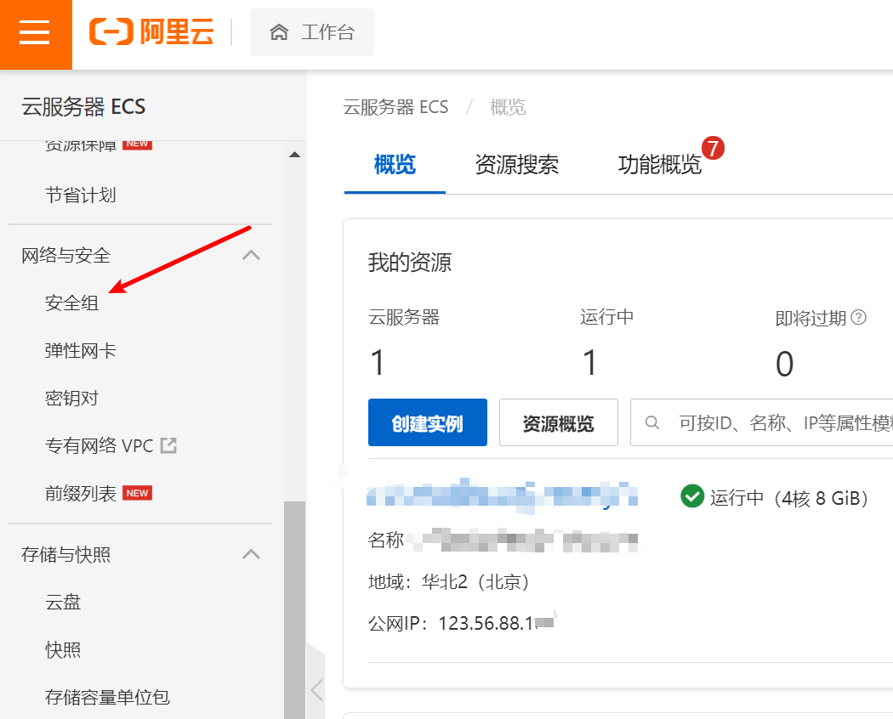
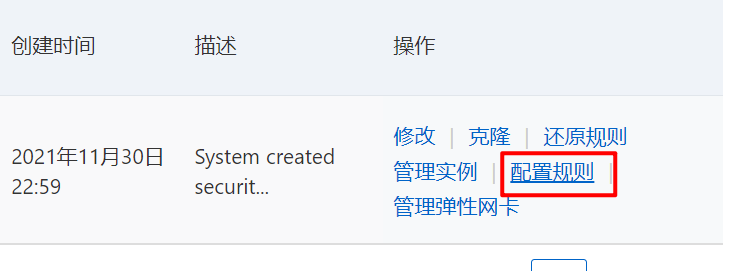
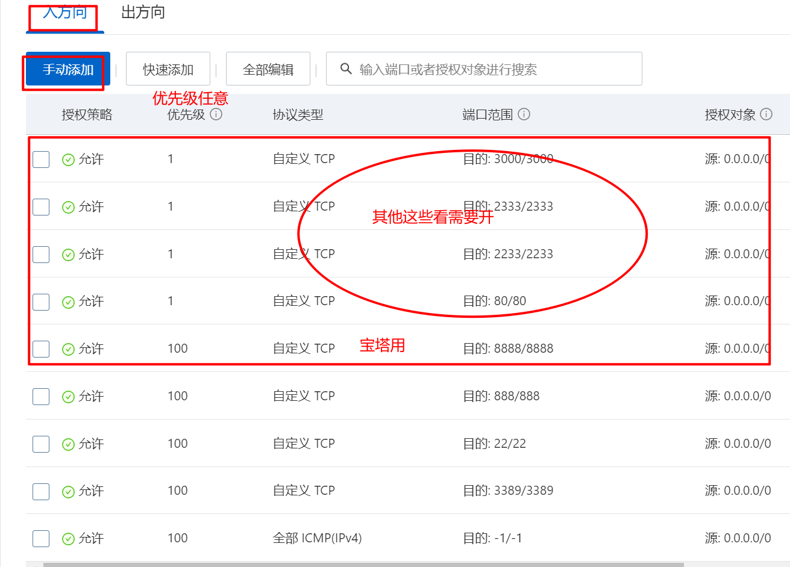

::: warning
这篇文章记录一下自己将vue项目部署到云服务器的过程与坑！！！
:::

<!-- more -->

## 流程

vue项目或者说所有前端项目部署到云服务器的流程都可以概括为一下：

购买云服务器—>简单配置云服务器—>注册域名(可选)—>服务器安装Nginx—>本地打包项目—>将打包好的项目上传服务器—>运行—>域名访问/ip访问

### step1:购买服务器

这部分就不详细说明了，网上可以找到很多教程，个人用挑便宜的就行啦。

### step2:简单配置服务器

因为后面会安装宝塔，所以先把8888端口加入安全组。宝塔面板依赖的端口有：8888、888、80、443、20和21端口，可以都开了，随意。步骤：找到安全组–》配置规则–》

